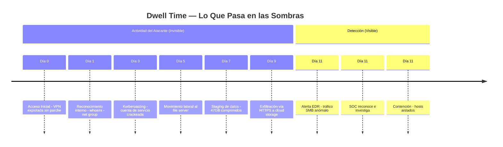
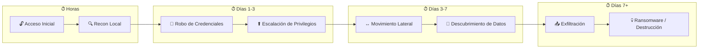
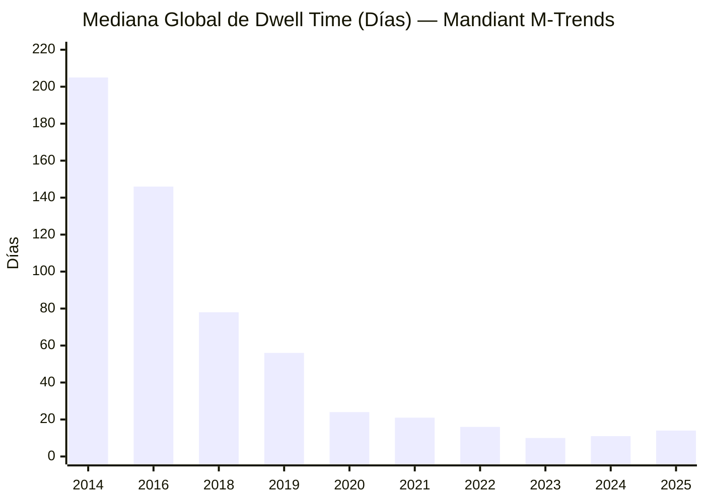
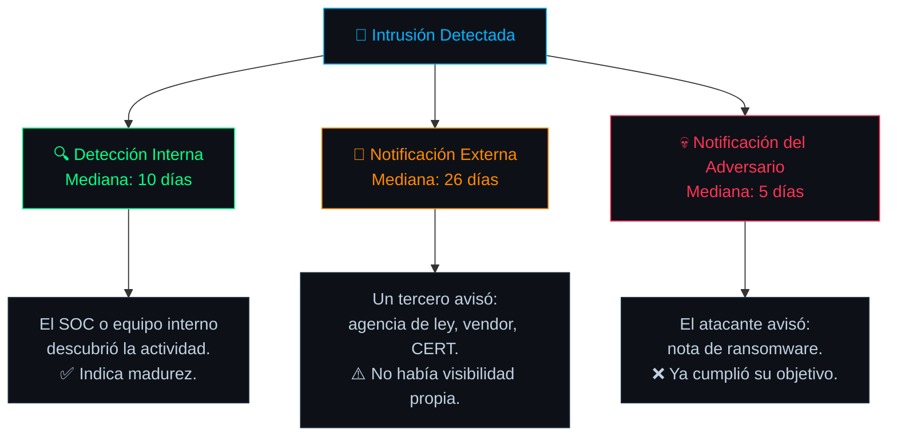
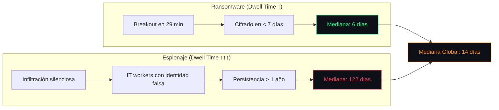
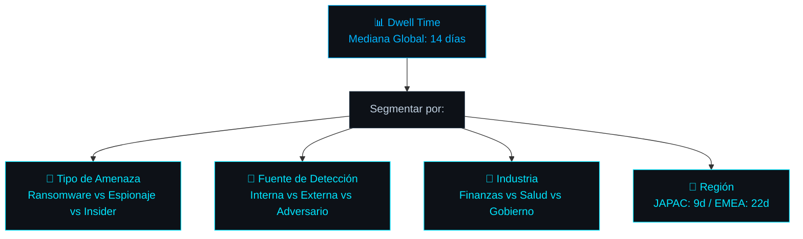
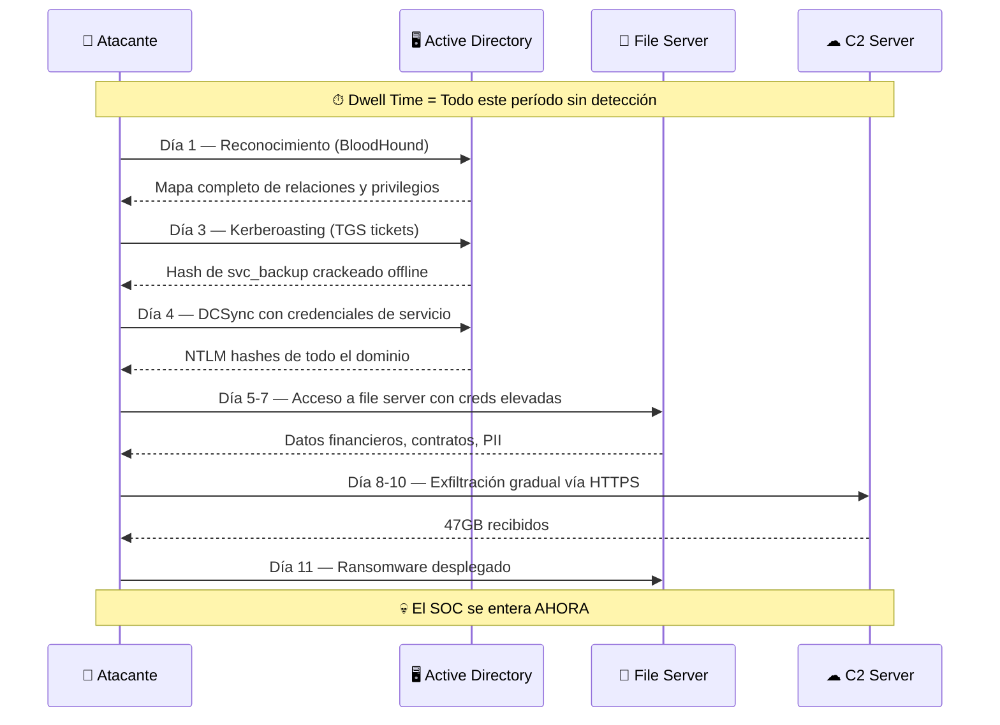
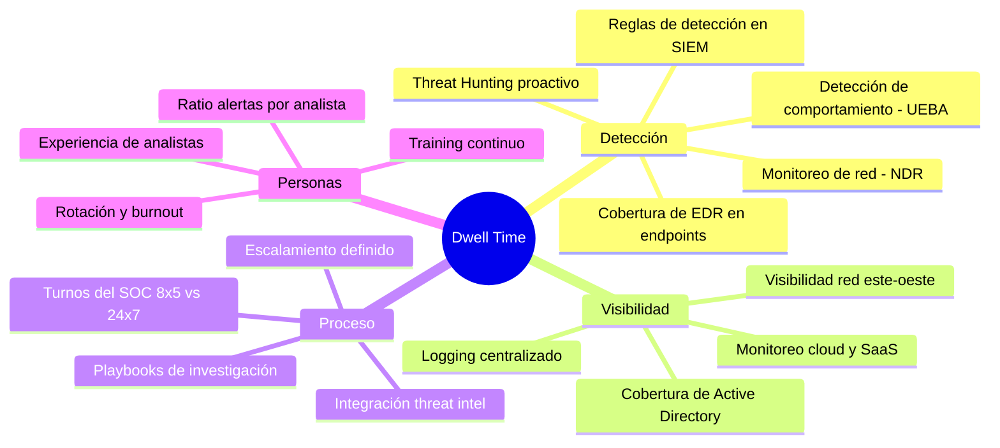

## Lo Que Pasa Antes de Que Alguien Se Entere

Toda brecha tiene un secreto incómodo: siempre existe un hueco temporal entre el momento en que un atacante entra y el momento en que alguien del lado defensivo se da cuenta. Ese hueco tiene nombre — **Dwell Time** (Tiempo de Permanencia) — y es la métrica estratégica más importante en Incident Response.

El Dwell Time es el período total que un adversario permanece dentro de un entorno comprometido **antes de ser detectado**. No antes de ser contenido. No antes de ser erradicado. Antes de que alguien siquiera *sepa* que está ahí.



Todo lo que está arriba de la línea de detección ocurrió en **completo silencio**. Sin alertas. Sin tickets. Sin conciencia de lo que pasaba. Eso es Dwell Time.

---

## La Fórmula

El cálculo en sí es simple. Lo difícil es determinar `T0`:

```
Dwell Time = Fecha_de_Detección − Fecha_de_Compromiso_Inicial
```

El problema práctico es que la `Fecha de Compromiso Inicial` casi siempre se determina **retroactivamente** durante el análisis forense. El analista tiene que reconstruir la línea temporal buscando la evidencia más temprana de actividad maliciosa en logs, artefactos de disco y capturas de red. Si el logging era insuficiente, `T0` quizás nunca se determine con precisión — lo que significa que el Dwell Time real probablemente fue **aún mayor** que el reportado.

> **Nota importante**: El Dwell Time se reporta como **mediana**, no como promedio. Esto es porque la distribución es extremadamente asimétrica — unas pocas operaciones de espionaje con Dwell Times de meses distorsionan cualquier promedio aritmético.
{: .prompt-info }

---

## Por Qué Importa — La Curva de Daño

El Dwell Time no es solo un número para dashboards ejecutivos. Correlaciona directamente con **cuánto daño puede causar el atacante**. A mayor tiempo sin ser detectado, más avanza en la cadena de ataque:



Un Dwell Time de **3 horas** significa que el atacante probablemente tiene foothold en una máquina y algo de reconocimiento local. Contener en esta fase es relativamente limpio: aislar el host, resetear la credencial comprometida, parchar la vulnerabilidad. Listo.

Un Dwell Time de **11 días** (la mediana global actual) significa que el atacante probablemente completó toda la kill chain: robo de credenciales, movimiento lateral a múltiples sistemas, descubrimiento de datos, y potencialmente exfiltración completa. Contener en esta fase es un engagement de IR completo — imágenes forenses de docenas de máquinas, rotación total de credenciales, threat hunting en toda la red, y semanas de recuperación.

> **La regla es simple**: cada día adicional de Dwell Time multiplica exponencialmente el esfuerzo de respuesta y el impacto al negocio.
{: .prompt-warning }

---

## Los Números: Datos de M-Trends (2014–2025)

La fuente más confiable para datos de Dwell Time es el reporte **M-Trends de Mandiant** (Google), publicado anualmente basándose en cientos de investigaciones de IR reales.

La tendencia histórica:



La tendencia a largo plazo es indiscutiblemente positiva — una **reducción del 96%**, de 205 días en 2014 a 11 días en 2024. Pero el ligero repunte en 2025 (a 14 días) cuenta una historia importante que se analiza más abajo.

---

## Las Tres Fuentes de Detección

No todos los Dwell Times son iguales. La forma en que se descubre la intrusión cambia radicalmente el número y lo que implica:



### Desglose por fuente (datos M-Trends 2025, investigaciones de 2024)

| Fuente de Detección | Mediana | Lo que implica |
|---|---|---|
| **Detección interna** | 10 días | La organización tiene visibilidad. El SOC funciona. |
| **Notificación externa** | 26 días | Un tercero (LE, vendor, CERT) avisó. Datos aparecieron en un mercado clandestino o inteligencia de terceros detectó la actividad. |
| **Notificación del adversario** | 5 días | El atacante avisó (ransom note). Es el más rápido, pero por la peor razón: ya completó su objetivo. |
| **Ransomware específico** | 6 días | El modelo de extorsión requiere velocidad. El atacante no quiere permanecer — quiere cobrar. |
| **Espionaje / NK IT workers** | 122 días | Operaciones diseñadas para persistencia a largo plazo. Algunos casos superaron el año sin detección. |

> **Dato clave del M-Trends 2026**: El repunte a 14 días en 2025 fue causado por el alto volumen de investigaciones de espionaje y operaciones de trabajadores IT de Corea del Norte (mediana de 122 días), que arrastraron la mediana global hacia arriba.
{: .prompt-tip }

---

## ¿Por Qué Aumentó en 2025?

Este punto merece atención especial porque parece contradictorio — ¿cómo puede subir el Dwell Time si las herramientas de detección son cada vez mejores?



La respuesta es la **composición del caseload**. En 2025, Mandiant investigó un volumen alto de operaciones de espionaje y amenazas internas (trabajadores IT norcoreanos usando identidades fabricadas para conseguir empleo en empresas occidentales). Estas operaciones están diseñadas específicamente para **no ser detectadas** — no despliegan ransomware, no generan ruido, no dejan artefactos obvios. Operan dentro del alcance de sus responsabilidades laborales legítimas, lo que las hace extremadamente difíciles de distinguir de la actividad normal.

Mientras tanto, los incidentes de ransomware (que tienen Dwell Times mucho más cortos) siguieron bajando. Pero la mezcla de muchos casos de espionaje con Dwell Times de 100+ días elevó la mediana global de 11 a 14.

---

## Dwell Time ≠ Un Solo Número

Esta es una de las trampas más comunes al usar esta métrica. El Dwell Time no debe tratarse como un valor único y uniforme. Hay que segmentarlo:



Por ejemplo, según M-Trends 2025:
- **JAPAC** (Asia-Pacífico/Japón) tuvo la detección más rápida con una mediana de **9 días**.
- **EMEA** (Europa/Medio Oriente/África) tuvo la más lenta con **22 días**, en parte debido a un incremento en actividad de ransomware.

Si una organización reporta "nuestro Dwell Time promedio es 15 días" sin segmentar, ese número puede esconder un incidente de ransomware detectado en 2 días y un compromiso de espionaje que llevaba 6 meses sin detectarse.

---

## Perspectiva Red Team → Blue Team

Este es el puente que conecta la mentalidad ofensiva con la defensiva, y que ayuda a entender por qué el Dwell Time importa desde ambos lados:

### ⚔️ Desde el Red Team

Para el atacante, el Dwell Time es su **recurso más valioso**. Todo lo que necesita hacer después del acceso inicial requiere tiempo:



Un operador de Red Team competente puede hacer **todo lo anterior** en un Dwell Time de 11 días. BloodHound, Kerberoasting, DCSync, movimiento lateral con PsExec/WMI — cada técnica del playbook de post-explotación consume tiempo, y 11 días es una cantidad *enorme* para alguien que sabe lo que hace.

### 🛡 Desde el Blue Team

Cada día de Dwell Time tiene un costo acumulativo para el equipo defensivo:

| Día de Dwell Time | Lo que significa para el Blue Team |
|---|---|
| **Día 1** | 1 host comprometido. 1 credencial que rotar. Contención simple. |
| **Día 3** | Posible escalación de privilegios. Hay que verificar integridad de AD. |
| **Día 5** | Movimiento lateral probable. Scope desconocido. Hay que hacer threat hunting en toda la red. |
| **Día 7** | Posible exfiltración. Hay que involucrar legal, compliance, y potencialmente reguladores. |
| **Día 11** | Compromiso total probable. Rotación completa de credenciales, rebuild de sistemas, semanas de forensics. Escenario de crisis. |

> **La conclusión es directa**: reducir el Dwell Time no es un objetivo de mejora continua abstracto. Es la diferencia literal entre un incidente contenido en una máquina y una catástrofe organizacional.
{: .prompt-danger }

---

## ¿Qué Factores Afectan el Dwell Time?

El Dwell Time no es una métrica que se reduzca con un solo cambio. Es el resultado de múltiples capacidades defensivas (o la falta de ellas):



La realidad es que una organización con un EDR de última generación pero sin logging centralizado, o con un SIEM perfecto pero un SOC que solo opera 8x5, seguirá teniendo Dwell Times altos. Cada componente es necesario pero no suficiente por sí solo.

---

## Ejemplo Práctico: Mismo Ataque, Tres Organizaciones

Para ilustrar cómo el Dwell Time varía según la madurez defensiva, se presenta el mismo escenario de ataque contra tres organizaciones con niveles de madurez diferentes:

**Escenario**: Un atacante explota una vulnerabilidad en el VPN (CVE-2024-21887 en Ivanti Connect Secure), instala un webshell, y comienza reconocimiento interno.

```mermaid
graph TD
    ATK["🔴 Mismo Ataque<br/>Exploit VPN Ivanti → Webshell → Recon"] --> ORG1
    ATK --> ORG2
    ATK --> ORG3

    subgraph ORG1["🏢 Org A — Madurez Baja"]
        O1A["Sin EDR"] --> O1B["Sin regla para webshells"]
        O1B --> O1C["SOC 8x5"]
        O1C --> O1D["⏱ Dwell Time: 45 días<br/>Detectado por notificación externa"]
    end

    subgraph ORG2["🏢 Org B — Madurez Media"]
        O2A["EDR básico"] --> O2B["SIEM con reglas genéricas"]
        O2B --> O2C["SOC 12x5"]
        O2C --> O2D["⏱ Dwell Time: 8 días<br/>SIEM detectó beaconing C2"]
    end

    subgraph ORG3["🏢 Org C — Madurez Alta"]
        O3A["EDR avanzado + NDR"] --> O3B["Regla Sigma para webshells Ivanti"]
        O3B --> O3C["SOC 24x7 + Threat Hunting"]
        O3C --> O3D["⏱ Dwell Time: 4 horas<br/>EDR detectó ejecución sospechosa"]
    end

    style O1D fill:#1a0a0a,stroke:#ff3355,color:#ff3355
    style O2D fill:#1a1a0a,stroke:#ff8800,color:#ff8800
    style O3D fill:#0a1a0a,stroke:#00ff88,color:#00ff88
```



La diferencia entre 45 días y 4 horas no es suerte — es inversión en capacidades de detección, reglas específicas para amenazas relevantes, y cobertura operativa del SOC.

---

## Relación con Otras Métricas TTx

El Dwell Time no existe en aislamiento. Es el resultado de otra métrica clave — el **MTTD** (Mean Time To Detect) — y alimenta todo lo que viene después:


La relación matemática clave:

```
Dwell Time ≥ MTTD (siempre)
```

Si se reduce MTTD a minutos, el Dwell Time se comprime automáticamente. Esto reduce drásticamente el impacto del incidente porque se interrumpe al atacante en las fases tempranas de la kill chain — antes de que haga credential theft, antes del movimiento lateral, antes de la exfiltración.

---

## Cómo Reducirlo: Acciones Concretas

No se trata de comprar una herramienta mágica. La reducción del Dwell Time requiere mejoras en múltiples frentes simultáneamente:

| Área | Acción Concreta | Impacto en Dwell Time |
|---|---|---|
| **Logging** | Habilitar Sysmon con config de SwiftOnSecurity en todos los endpoints. Centralizar eventos de AD (4624, 4625, 4672, 4768, 4769). | Elimina puntos ciegos donde el atacante opera sin dejar trazas. |
| **Detección** | Implementar reglas Sigma mapeadas a MITRE ATT&CK para las TTPs que los threat actors de tu industria realmente usan. | Pasa de "buscar IOCs conocidos" a "detectar comportamientos maliciosos" — los IOCs cambian, los comportamientos no. |
| **Tuning** | Reducir falsos positivos agresivamente. Si el 90% de las alertas son FP, la alerta real se pierde en el ruido. | Reduce MTTA indirectamente: menos ruido = alertas reales más visibles. |
| **Cobertura** | Extender SOC de 8x5 a 16x5 o 24x7 (incluso con MDR externo si no hay presupuesto para equipo propio). | Elimina la ventana de 16 horas nocturnas donde nadie mira las alertas. |
| **Threat Hunting** | Ejecutar hunts periódicos buscando TTPs específicas sin depender de alertas. | Encuentra lo que las reglas automatizadas no detectan — el delta entre "lo que podemos detectar" y "lo que realmente hay". |

---

## Conclusión

El Dwell Time es la métrica que convierte la seguridad en algo medible y accionable. No es un número para presentaciones ejecutivas — es un indicador directo de cuánto daño puede causar un atacante antes de que el equipo defensivo siquiera sepa que hay un problema.

Los datos de Mandiant M-Trends muestran una mejora sostenida a lo largo de la última década (de 205 a 11 días), pero también revelan que el número global esconde realidades muy diferentes según el tipo de amenaza, la región, y la madurez de la organización.

La próxima entrada de esta serie cubrirá las métricas **MTTD, MTTA y MTTI** — los segmentos temporales que componen el Dwell Time y que el SOC puede medir y optimizar directamente.

---

*Fuentes: Mandiant M-Trends 2025 Report (abril 2025), Mandiant M-Trends 2026 Report (abril 2026), CrowdStrike 2026 Global Threat Report (febrero 2026).*
