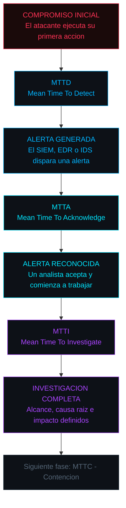
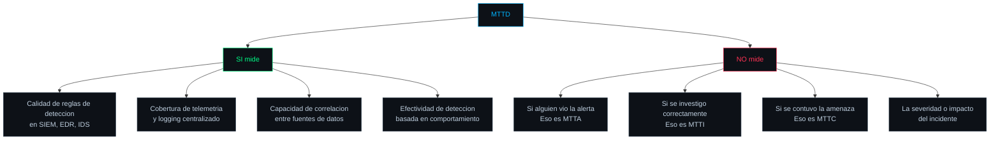
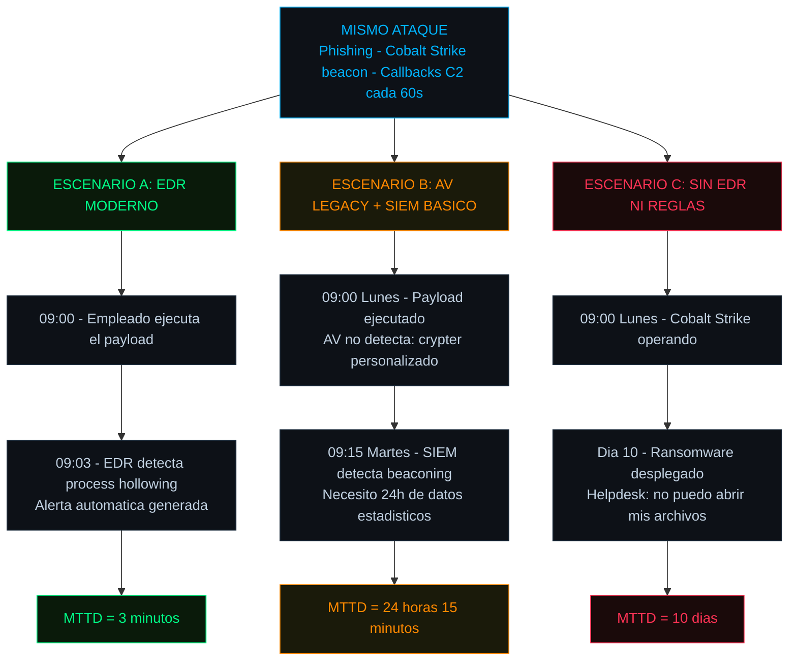
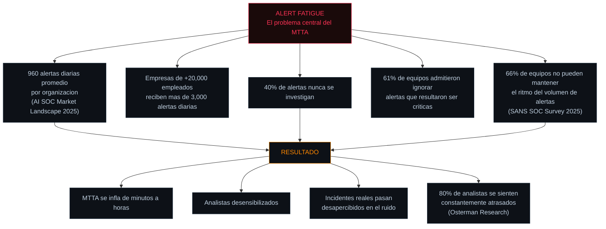
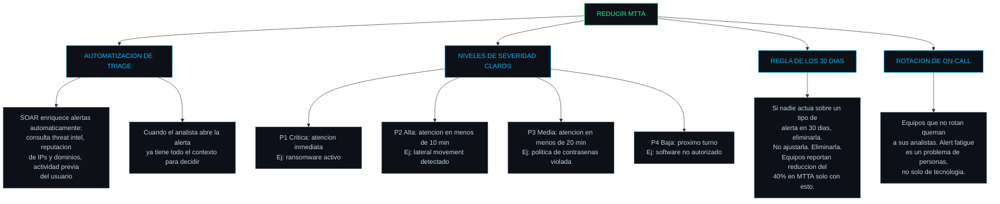
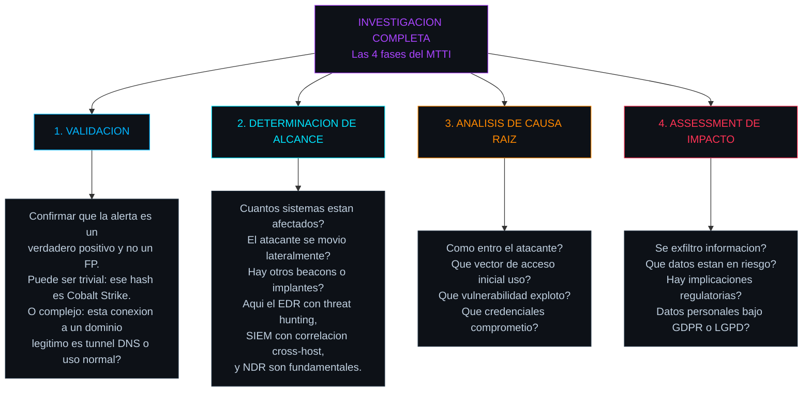
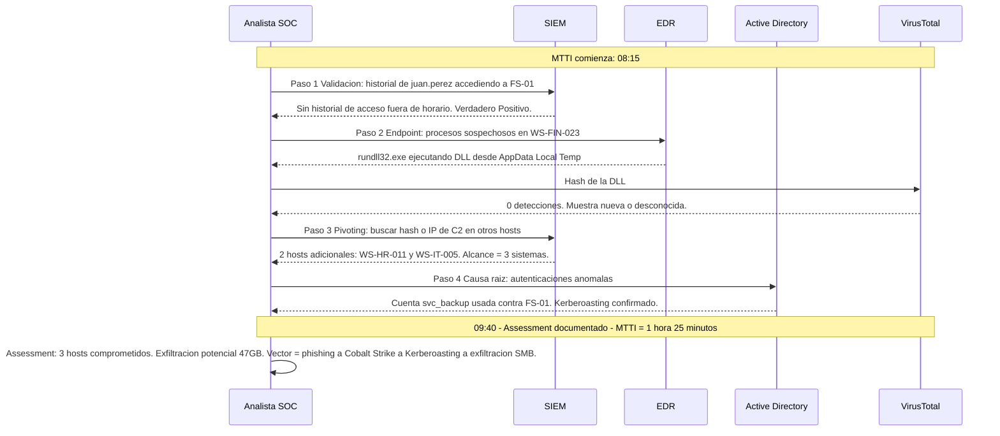
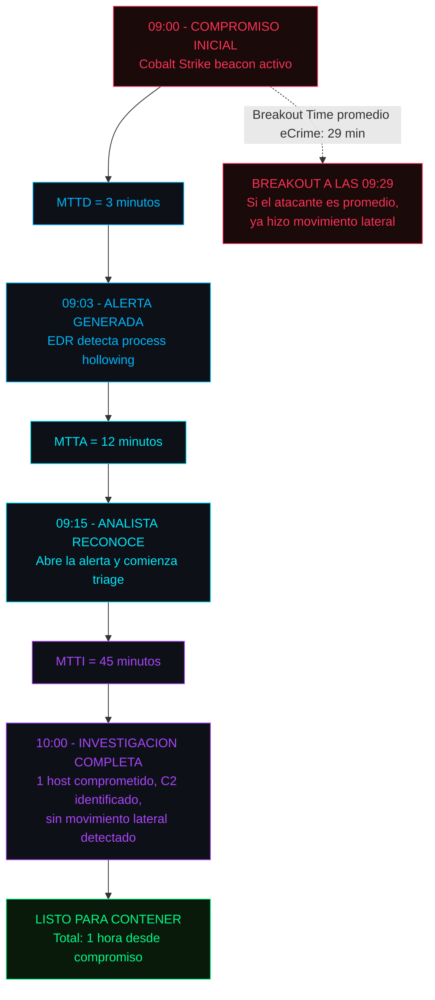
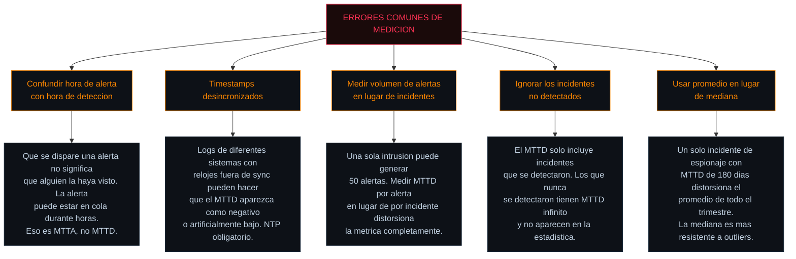

## La carrera contra el reloj empieza aquí

En la entrada anterior https://tnagata.com/posts/dwell-time-La-Metrica-que-Separa-la-Contencion-de-la-Cataastrofe/ se explicó el Dwell Time como la métrica estratégica que mide cuánto tiempo permanece un atacante sin ser detectado. Pero el Dwell Time es un resultado — no se puede mejorar directamente. Lo que sí se puede mejorar son los tres segmentos temporales que lo componen: **detectar** la amenaza, **reconocer** la alerta y **investigar** el incidente.

Estas tres métricas conforman el grupo de **Detección y Triaje**, y juntas determinan cuánto tiempo pasa desde que un atacante ejecuta su primera acción maliciosa hasta que el equipo de seguridad comprende lo que está pasando y puede actuar.



La relación matemática fundamental es:

```
Tiempo_hasta_respuesta = MTTD + MTTA + MTTI
```

Si esa suma es mayor que el Breakout Time del atacante (29 minutos en promedio para eCrime en 2025, según CrowdStrike), el adversario completa su movimiento lateral **antes** de que el SOC siquiera entienda lo que está pasando.

---

## MTTD — Mean Time To Detect

### Definición técnica

MTTD mide el tiempo promedio entre el momento en que ocurre la actividad maliciosa y el momento en que el stack de seguridad de la organización **genera una alerta** o un analista identifica la anomalía. Es la métrica que refleja la capacidad de detección pura — la calidad de los sensores, las reglas, la telemetría y la cobertura de monitoreo.

Un MTTD bajo significa que las herramientas de seguridad (SIEM, EDR, NDR, UEBA) están capturando la actividad maliciosa rápidamente. Un MTTD alto indica puntos ciegos: endpoints sin agente, segmentos de red sin visibilidad, reglas de detección insuficientes, o simplemente que el atacante está usando técnicas que evaden las detecciones existentes.

### Fórmula

```
MTTD = Suma(Timestamp_Alerta - Timestamp_Compromiso) / Numero_de_incidentes
```

> **Nota importante**: determinar el `Timestamp_Compromiso` es el desafío real. Se establece retroactivamente durante el análisis forense buscando la evidencia más temprana de actividad maliciosa en logs, artefactos de disco y capturas de red. Si la telemetría es insuficiente, T0 no se puede determinar con precisión — y el MTTD reportado será artificialmente bajo.
{: .prompt-info }

### Benchmarks de industria

No existe un benchmark universal porque el MTTD depende del tamaño de la organización, la industria y el modelo de amenazas. Pero las fuentes más confiables proporcionan rangos de referencia:

| Fuente | Dato | Contexto |
|---|---|---|
| **SANS 2023 IR Survey** | Top 25% detecta en menos de 60 minutos | Medido a nivel SOC en incidentes activos |
| **SANS 2023 IR Survey** | Mas del 50% detecta en menos de 5 horas | Incluye organizaciones medianas |
| **IBM Cost of a Data Breach 2025** | Promedio de 158 dias para identificar brechas | Medido a nivel de brecha completa, no alertas individuales |
| **Prophet Security 2026** | Top performers: 30 min a 4 horas | Rango objetivo para SOCs maduros |
| **Industrias de alto riesgo** | Objetivo: menos de 1 hora | Finanzas, salud, infraestructura critica |

La diferencia entre el dato de SANS (minutos a horas) y el de IBM (158 dias) no es una contradicción — refleja dos cosas distintas. El MTTD a nivel de SOC mide alertas en tiempo real contra actividad conocida. El dato de IBM mide brechas completas, incluyendo intrusiones lentas y sigilosas que evadieron toda la detección inicial durante meses.

### Que mide y que no mide



### Tres escenarios comparativos: mismo ataque, diferente MTTD

El mismo ataque produce resultados radicalmente distintos según el stack de detección disponible. Escenario: un empleado de finanzas recibe un phishing dirigido a las 09:00 del lunes. Hace clic en el enlace y se instala un loader de Cobalt Strike. El beacon inicia callbacks C2 cada 60 segundos.



La diferencia entre un MTTD de 3 minutos y uno de 10 dias es la diferencia entre contener un incidente en fase inicial o sufrir un evento catastrófico. Y la variable que determina esa diferencia no es suerte — es la inversión en el stack de detección.

### Factores que inflan el MTTD

```mermaid
graph TD
    HIGH["MTTD ALTO<br/>El atacante opera sin ser visto"]

    HIGH --> F1["GAPS DE VISIBILIDAD"]
    F1 --> F1a["Endpoints sin EDR"]
    F1 --> F1b["Segmentos de red sin captura"]
    F1 --> F1c["Servidores sin Sysmon"]
    F1 --> F1d["Cloud sin logging habilitado"]

    HIGH --> F2["REGLAS INSUFICIENTES"]
    F2 --> F2a["Solo deteccion basada en IOCs<br/>hashes, IPs, dominios"]
    F2 --> F2b["Sin reglas de comportamiento<br/>para TTPs reales"]
    F2 --> F2c["Reglas no mapeadas a<br/>MITRE ATT&CK"]

    HIGH --> F3["RUIDO EXCESIVO"]
    F3 --> F3a["73% de equipos citan falsos<br/>positivos como desafio principal<br/>(SANS 2025)"]
    F3 --> F3b["40% de alertas nunca se<br/>investigan (AI SOC Market 2025)"]
    F3 --> F3c["La alerta real se pierde<br/>entre 500 alertas diarias"]

    HIGH --> F4["COBERTURA TEMPORAL"]
    F4 --> F4a["SOC opera solo 8x5"]
    F4 --> F4b["16 horas nocturnas sin<br/>nadie mirando alertas"]

    style HIGH fill:#1a0a0a,stroke:#ff3355,color:#ff3355
    style F1 fill:#0d1117,stroke:#ff8800,color:#ff8800
    style F2 fill:#0d1117,stroke:#ff8800,color:#ff8800
    style F3 fill:#0d1117,stroke:#ff8800,color:#ff8800
    style F4 fill:#0d1117,stroke:#ff8800,color:#ff8800
    style F1a fill:#0d1117,stroke:#1a2a3a,color:#c0d0e0
    style F1b fill:#0d1117,stroke:#1a2a3a,color:#c0d0e0
    style F1c fill:#0d1117,stroke:#1a2a3a,color:#c0d0e0
    style F1d fill:#0d1117,stroke:#1a2a3a,color:#c0d0e0
    style F2a fill:#0d1117,stroke:#1a2a3a,color:#c0d0e0
    style F2b fill:#0d1117,stroke:#1a2a3a,color:#c0d0e0
    style F2c fill:#0d1117,stroke:#1a2a3a,color:#c0d0e0
    style F3a fill:#0d1117,stroke:#1a2a3a,color:#c0d0e0
    style F3b fill:#0d1117,stroke:#1a2a3a,color:#c0d0e0
    style F3c fill:#0d1117,stroke:#1a2a3a,color:#c0d0e0
    style F4a fill:#0d1117,stroke:#1a2a3a,color:#c0d0e0
    style F4b fill:#0d1117,stroke:#1a2a3a,color:#c0d0e0
```



### Estrategias de reduccion

| Estrategia | Detalle técnico | Impacto |
|---|---|---|
| **Cobertura de logging** | Habilitar Sysmon (config SwiftOnSecurity) en todos los endpoints. Centralizar eventos de AD: 4624, 4625, 4672, 4768, 4769. | Elimina puntos ciegos donde el atacante opera sin dejar trazas. |
| **Reglas basadas en TTPs** | Implementar reglas Sigma mapeadas a MITRE ATT&CK. Priorizar las técnicas que los threat actors relevantes para la industria realmente usan. | Detecta comportamientos en lugar de IOCs. Los IOCs cambian diariamente; los comportamientos son estables. |
| **Detección por comportamiento** | UEBA para identificar anomalias: un usuario que nunca accede a servidores de desarrollo ejecuta `whoami` y `net group "Domain Admins"` a las 3 AM. | Detecta lo que las firmas no pueden: credenciales legítimas usadas de forma ilegítima. |
| **Tuning agresivo de FP** | Reducir falsos positivos hasta que al menos el 30% de las alertas sean accionables. SOCs maduros apuntan a mas del 50%. | Menos ruido hace que las alertas reales sean visibles. Impacto directo en MTTA también. |
| **Cobertura 24x7** | Extender el SOC de 8x5 a 24x7, aunque sea con MDR externo. | Elimina las 16 horas nocturnas donde nadie mira las alertas. |

### Perspectiva Red Team a Blue Team

Desde el lado ofensivo, el MTTD es exactamente lo que el atacante intenta maximizar. Cada técnica de evasión (ofuscación de payloads, uso de herramientas legítimas, tunneling DNS, beaconing con jitter aleatorio) tiene un solo propósito: **evitar que el MTTD sea bajo**. El atacante sabe que si el EDR detecta su beacon en 3 minutos, el engagement falló. Pero si puede evadir la detección durante días, tiene tiempo para completar la kill chain.

Desde el lado defensivo, el MTTD es la primera barrera. Si falla, todo lo demás (MTTA, MTTI, MTTC) es irrelevante — no se puede reconocer una alerta que nunca se generó, ni investigar un incidente que nunca se detectó.

---

## MTTA — Mean Time To Acknowledge

### Definición técnica

MTTA mide el tiempo promedio entre el momento en que **se genera una alerta** y el momento en que **un analista humano la reconoce** y comienza a trabajar en ella. Es el "tiempo muerto" entre la detección automatizada y la intervención humana.

Una alerta sin reconocer es un incidente sin gestionar. El MTTA captura un problema estructural de los SOC modernos: las alertas se generan pero nadie las mira durante minutos, horas o incluso días.

### Fórmula

```
MTTA = Suma(Timestamp_Acknowledge - Timestamp_Alerta) / Numero_de_incidentes
```

### Benchmarks

| Severidad | Objetivo MTTA | Fuente |
|---|---|---|
| **Critica (SEV-1)** | Menos de 5 minutos | MetricFire 2026, Prophet Security |
| **Alta (SEV-2)** | Menos de 10 minutos | MetricFire 2026 |
| **Media (SEV-3)** | Menos de 20 minutos | MetricFire 2026 |
| **Baja (SEV-4)** | Menos de 1 hora | General |
| **Top performers general** | 10 minutos a 1 hora | Prophet Security 2026 |

> **Dato alarmante**: un MTTA de 36 minutos ya se considera demasiado lento para gestión moderna de incidentes según MetricFire. Si el Breakout Time promedio de eCrime es de 29 minutos, incluso un MTTA de 30 minutos significa que el atacante ya hizo movimiento lateral antes de que un analista siquiera abriera la alerta.
{: .prompt-danger }

### La crisis del alert fatigue

El MTTA no se infla por incompetencia de los analistas. Se infla por un problema sistémico que tiene nombre propio: **alert fatigue**.



### Ejemplo comparativo: mismo SOC, diferente contexto

Para demostrar que el MTTA es sensible al contexto operativo, se presenta la misma alerta en dos momentos distintos del mismo SOC:

**Alerta**: "Suspicious PowerShell execution — encoded command detected" en un servidor de base de datos de producción.

| Condición | Hora de alerta | Hora de acknowledge | MTTA | Por que |
|---|---|---|---|---|
| **Turno nocturno, baja carga** | 02:30 AM | 02:47 AM | 17 minutos | Pocas alertas en cola. El analista pudo atenderla rápido. |
| **Martes post-Patch Tuesday** | 10:15 AM | 11:30 AM | 1 hora 15 min | 200+ alertas de cambios de configuración. La alerta real se enterró en el backlog. |

La diferencia no es la calidad del equipo — es la relación señal/ruido. El mismo analista, con las mismas habilidades, produce un MTTA 4 veces peor cuando el ruido de fondo es alto.

### Estrategias de reduccion



> **La regla de los 30 dias** merece atención especial: si un tipo de alerta lleva 30 dias sin que nadie actúe sobre ella, se debe eliminar del pipeline. No ajustar. No reducir severidad. Eliminar. Suena radical, pero equipos que lo implementaron reportan reducciones del 40% en MTTA porque el volumen de ruido baja drásticamente.
{: .prompt-tip }

---

## MTTI — Mean Time To Investigate

### Definición técnica

MTTI mide el tiempo promedio desde que un analista **reconoce una alerta** hasta que la investigación se **completa**: se comprende que ocurrió, que sistemas están afectados, cuál es el alcance del compromiso y cuál es la respuesta apropiada. Es el tiempo de análisis puro — la fase donde la experiencia del analista, la calidad de las herramientas y la disponibilidad de telemetría hacen la diferencia.

### Fórmula

```
MTTI = Suma(Timestamp_Fin_Investigacion - Timestamp_Acknowledge) / Numero_de_incidentes
```

El desafío práctico es definir cuándo "termina" la investigación. En la práctica, se marca cuando el analista escala el incidente con un assessment completo o cuando se toma la decisión de contener.

### Benchmarks

| Nivel | Objetivo MTTI | Contexto |
|---|---|---|
| **Top performers** | 10 minutos a 1 hora | SOCs con SOAR y enriquecimiento automatizado |
| **Promedio aceptable** | 1 a 4 horas | SOCs con herramientas integradas |
| **Organizaciones con gaps** | 4 a 24 horas | Herramientas fragmentadas, investigación manual |

> **Advertencia**: para organizaciones con altas tasas de falsos positivos, hacer tuning de esas alertas puede aumentar artificialmente el MTTI porque los FP que antes se cerraban en 2 minutos (sin investigar realmente) desaparecen del cálculo, y solo quedan los verdaderos positivos que requieren investigación real. Eso no es malo — es una representación más honesta de la métrica.
{: .prompt-warning }

### Que incluye la investigación



### Walkthrough de investigación paso a paso

Para hacer tangible lo que ocurre durante el MTTI, se presenta un caso real completo. El SOC recibe una alerta del NDR: "Anomalous SMB traffic from WS-FIN-023 to FS-01 at 03:00 — 47GB transferred".



**Resultado del MTTI**: 1 hora 25 minutos. El analista pudo determinar el alcance (3 sistemas), la causa raíz (Kerberoasting de cuenta de servicio) y el impacto potencial (47GB de datos posiblemente exfiltrados). Toda esa información es necesaria para que la fase de contención sea efectiva.

### Factores que inflan el MTTI

| Factor | Por que infla el MTTI | Solución |
|---|---|---|
| **Falta de contexto automatizado** | El analista abre 5 consolas diferentes (SIEM, EDR, firewall, DNS, AD) y correlaciona manualmente. | SOAR que pre-enriquece alertas con IOCs, reputación y contexto del usuario. |
| **Logging insuficiente** | Sin Sysmon configurado, no se ven ejecuciones de DLLs sospechosas. El analista busca información que no existe. | Sysmon con reglas de SwiftOnSecurity u Olaf Hartong en todos los endpoints. |
| **Herramientas fragmentadas** | Analista usa 7 herramientas con 7 logins diferentes. El context switching consume tiempo. | Plataformas XDR o SIEM con integraciones nativas a EDR, NDR y threat intel. |
| **Falta de experiencia** | Un analista junior puede tardar 4 horas en lo que un senior hace en 30 minutos. | Playbooks detallados paso a paso, mentoring, y ejercicios regulares con CyberDefenders o similares. |
| **Alertas sin contexto** | La alerta dice "suspicious activity" sin detalles. El analista parte de cero. | Reglas de detección que incluyan contexto: usuario, host, proceso padre, comando ejecutado. |

### Perspectiva Red Team a Blue Team

Desde el lado ofensivo, el MTTI es la ventana donde el atacante todavía puede operar mientras el analista está "mirando". Si el atacante sabe que fue detectado (por ejemplo, porque ve que su beacon dejó de recibir callbacks), puede intentar pivotar a otro implante, escalar privilegios rápidamente, o destruir evidencia antes de que la investigación termine.

Desde el lado defensivo, el MTTI es la fase donde la calidad del trabajo determina todo lo que sigue. Una investigación incompleta lleva a una contención incompleta — si no se identifican todos los hosts comprometidos, los que se pierden siguen en manos del atacante.

---

## Las tres métricas juntas: el pipeline de detección y triaje

Para ver el impacto combinado de MTTD + MTTA + MTTI, se presenta un solo incidente medido en cada fase:



En este ejemplo, el equipo completó su pipeline de detección y triaje en **1 hora**. Pero el Breakout Time promedio de eCrime fue de 29 minutos — lo que significa que a las 09:29, el atacante ya se movió lateralmente, y cuando la investigación termina a las 10:00, el alcance real puede ser mayor que el detectado inicialmente.

> **La implicación operativa es directa**: incluso con un MTTD excelente de 3 minutos, si el MTTA + MTTI suman más de 26 minutos, el atacante completa su breakout antes de que el SOC tenga la imagen completa. Esto es lo que hace que la automatización del triage (SOAR) y la contención automatizada (auto-isolation en EDR) sean cada vez más necesarias.
{: .prompt-danger }

---

## Errores comunes al medir estas métricas

Antes de cerrar, es importante señalar las trampas más frecuentes en la medición de MTTD, MTTA y MTTI:



---

## Resumen del grupo de detección y triaje

| Métrica | Que mide | Segmento | Benchmark objetivo |
|---|---|---|---|
| **MTTD** | Compromiso hasta primera alerta | T0 a T1 | Menos de 1 hora (critico), menos de 4 horas (general) |
| **MTTA** | Alerta hasta que un analista la acepta | T1 a T2 | Menos de 5 min (SEV-1), menos de 20 min (SEV-3) |
| **MTTI** | Acknowledge hasta investigación completa | T2 a T3 | 10 min a 1 hora (top), 1 a 4 horas (aceptable) |
| **Suma** | Compromiso hasta assessment completo | T0 a T3 | Debe ser menor al Breakout Time del adversario |

La próxima entrada de esta serie cubrirá el segundo grupo de métricas: **MTTC y MTTR** — las métricas de contención y recuperación que determinan cuánto tiempo toma detener al atacante y restaurar las operaciones.

---

*Fuentes: SANS 2023 IR Survey, SANS 2025 SOC Survey, IBM Cost of a Data Breach Report 2025, CrowdStrike 2026 Global Threat Report, AI SOC Market Landscape 2025, Osterman Research Report 2025, Prophet Security SOC Metrics 2026, MetricFire MTTR/MTTA/MTTD Guide 2026, Rapid7 MTTD Fundamentals.*
